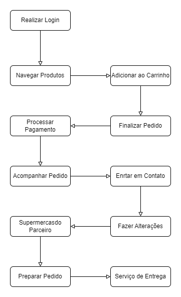

**Quick Market - Fluxograma**

Este fluxograma simplificado representa o fluxo principal da plataforma de entrega de produtos de mercado online. Inicia-se com a navegação do cliente pelo catálogo de produtos, onde ele seleciona os itens desejados e os adiciona ao carrinho. Em seguida, o cliente finaliza a compra e processa o pagamento. Uma vez confirmada a compra, o pedido é preparado e agendada a entrega ou retirada. O serviço de entrega ou o cliente retiram o pedido e a entrega é realizada. Por fim, o fluxo é concluído.

Observe que este fluxograma é uma representação simplificada do fluxo principal e não inclui detalhes como possíveis ramificações ou exceções que possam ocorrer durante o processo.